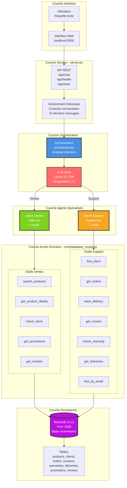
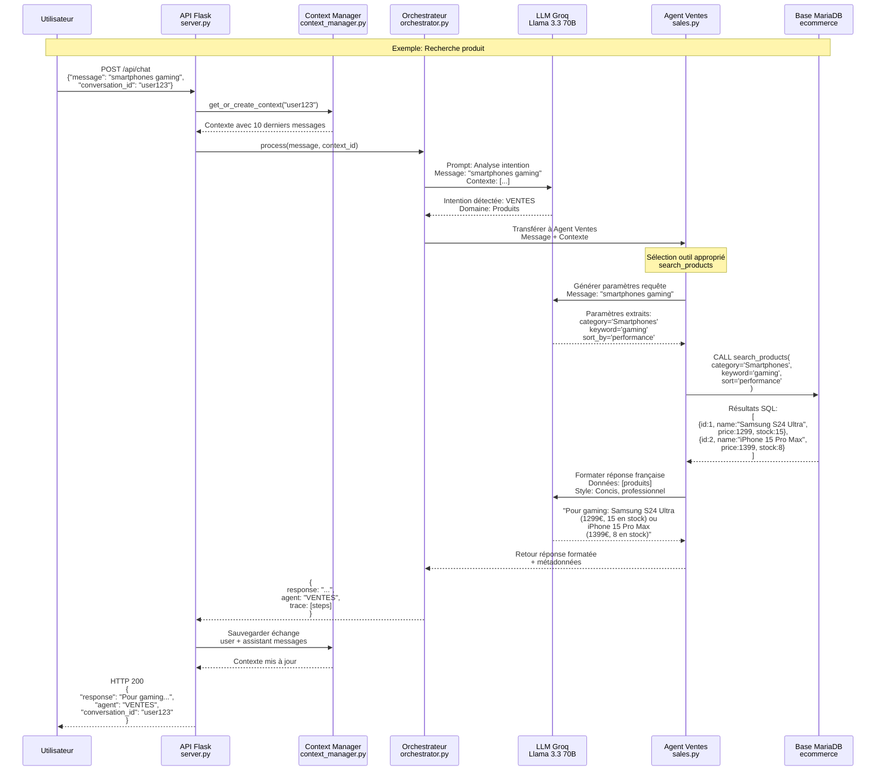

# Système Multi-Agents pour E-Commerce

Plateforme conversationnelle intelligente utilisant des agents spécialisés avec intégration base de données temps réel.

[](https://python.org)
[](https://docker.com)
[](#tests)

---

## Résumé du Système

Ce projet implémente un système multi-agents pour le service client e-commerce. Trois agents spécialisés collaborent pour traiter les requêtes utilisateur:

- **Agent Ventes** (5 outils DB): Recherche produits, stock, prix, promotions, avis
- **Agent Support** (7 outils DB): Gestion commandes, livraisons, factures, garanties, SAV
- **Orchestrateur**: Analyse l'intention et route vers l'agent approprié

Le système utilise **LangChain** avec le modèle **Llama 3.3 70B** (via Groq), une base **MariaDB**, et expose une API REST via **Flask**.

**Caractéristiques techniques:**
- Réponses en français (même pour input anglais)
- 17 fonctions base de données
- Mémorisation contexte (10 derniers messages)
- Tests automatisés (100% réussite)
- Interface web + API REST

---

## Installation Rapide

### Méthode 1: Installation Fraîche (Recommandée)

Si vous rencontrez des problèmes ou voulez repartir de zéro:

```bash
make fresh
```

**Cette commande va:**
1. ✓ Arrêter et supprimer tous les conteneurs Docker existants
2. ✓ Supprimer tous les volumes de base de données (données effacées)
3. ✓ Nettoyer le dossier `db_data/` (stockage persistant)
4. ✓ Nettoyer tous les fichiers cache Python (`__pycache__`)
5. ✓ Réinstaller les dépendances Python (`pip install`)
6. ✓ Redémarrer les conteneurs Docker (MariaDB + phpMyAdmin)
7. ✓ Initialiser le schéma de base de données avec données de test
8. ✓ Système prêt à l'emploi

**Attention:** Cette commande supprime TOUTES les données de la base existante. Utilisez-la uniquement pour:
- Premier démarrage du projet
- Réinitialisation complète après erreurs
- Nettoyage pour tests

### Méthode 2: Installation Standard

Si c'est votre première installation ou que vous n'avez pas de problèmes:

```bash
# 1. Installer Make (si nécessaire)
choco install make          # Windows (Chocolatey)
# OU
scoop install make          # Windows (Scoop)
# OU
sudo apt install make       # Linux/Ubuntu
# OU
brew install make           # macOS

# 2. Installation complète
make install                # Installer dépendances Python
make setup                  # Démarrer base de données + vérifier schéma

# 3. Configuration
echo "GROQ_API_KEY=votre_cle_ici" > .env

# 4. Démarrage
make serve                  # Lancer le serveur

# 5. Accès
# Interface: http://localhost:5000
# phpMyAdmin: http://localhost:3009
```

**Note:** `make setup` vérifie si une base existe déjà et demande confirmation avant réinitialisation.

---

## Installation Manuelle

Si Make n'est pas disponible:

```bash
# 1. Installer dépendances Python
pip install -r requirements.txt

# 2. Démarrer conteneurs Docker
docker-compose up -d

# 3. Attendre initialisation MySQL (10 secondes)
timeout /t 10              # Windows
sleep 10                   # Linux/Mac

# 4. Initialiser base de données
docker exec -i chatbot_mariadb mariadb -uroot ecommerce < ecommerce.sql

# 5. Configurer clé API
echo "GROQ_API_KEY=votre_cle_ici" > .env

# 6. Démarrer serveur
python server.py
```

---

## Commandes Disponibles

### Commandes Make

| Commande | Description |
|----------|-------------|
| `make help` | Afficher toutes les commandes |
| `make fresh` | **RÉINITIALISATION COMPLÈTE** - Tout supprimer et réinstaller |
| `make install` | Installer dépendances Python |
| `make setup` | Installation complète (install + db-start + db-init) |
| `make serve` | Démarrer serveur Flask |
| `make db-start` | Démarrer MariaDB et phpMyAdmin |
| `make db-stop` | Arrêter tous conteneurs |
| `make db-init` | Réinitialiser base de données |
| `make test` | Lancer tests automatisés |
| `make clean` | Nettoyer fichiers cache Python |

### Commandes Directes

**Gestion serveur:**
```bash
python server.py           # Démarrer serveur Flask
```

**Gestion base de données:**
```bash
docker-compose up -d                                    # Démarrer conteneurs
docker-compose down                                     # Arrêter conteneurs
docker exec -i chatbot_mariadb mariadb -uroot ecommerce < ecommerce.sql  # Réinitialiser
docker exec -it chatbot_mariadb mariadb -uroot ecommerce                 # Shell MySQL
docker logs chatbot_mariadb                             # Voir logs MySQL
```

**Tests:**
```bash
python tests/test_all_scenarios.py                      # Lancer suite tests
```

### API REST

**Envoyer message:**
```bash
curl -X POST http://localhost:5000/api/chat \
  -H "Content-Type: application/json" \
  -d '{"message":"smartphones gaming","conversation_id":"user123"}'
```

**Vérifier santé système:**
```bash
curl http://localhost:5000/api/health
```

**Nettoyer historique conversation:**
```bash
curl -X POST http://localhost:5000/api/clear
```

---

## Points d'Accès

| Service | URL | Identifiants |
|---------|-----|--------------|
| **Interface Chat** | http://localhost:5000 | - |
| **phpMyAdmin** | http://localhost:3009 | - |
| **Base MariaDB** | `localhost:3308` | User: `root`, Password: *(vide)* |

**Connexion directe base:**
```
Hôte: localhost
Port: 3308
Utilisateur: root
Mot de passe: (vide)
Base: ecommerce
```

---

## Architecture Système

### Vue d'Ensemble

Le système suit une architecture à couches avec séparation claire des responsabilités.



### Flux de Traitement Complet

Séquence détaillée du traitement d'une requête utilisateur depuis la réception jusqu'à la réponse.



### Agents et Outils

| Composant | Agent Ventes | Agent Support |
|-----------|--------------|---------------|
| **Fichier source** | `agents/sales.py` | `agents/support.py` |
| **Modèle LLM** | Llama 3.3 70B (temp: 0.3) | Llama 3.3 70B (temp: 0.2) |
| **Nombre outils** | 5 fonctions database | 7 fonctions database |
| **Domaine métier** | Catalogue, stock, prix, promotions | Commandes, SAV, livraisons, factures |
| **Cas d'usage** | "cherche laptop", "en stock?", "promos" | "commande CMD-123", "où est colis?", "facture" |

---

## Structure du Projet

```
Multi-Agent-Chatbot/
│
├── agents/                         # Agents IA
│   ├── orchestrator.py             #   Routage intelligent basé intention
│   ├── sales.py                    #   Agent ventes (5 outils DB)
│   └── support.py                  #   Agent support (7 outils DB)
│
├── core/                           # Logique métier
│   ├── database_mysql.py           #   17 fonctions accès base données
│   ├── smart_extractor.py          #   Extraction entités (dates, IDs, emails)
│   ├── auth_system.py              #   Authentification clients
│   └── context_manager.py          #   Gestion mémoire conversationnelle
│
├── forms/                          # Gestion formulaires
│   ├── form_manager.py             #   Templates et validation
│   └── secure_forms.py             #   Sécurisation inputs sensibles
│
├── config/                         # Configuration et documentation
│   ├── database_functions.md       #   Catalogue 17 fonctions DB
│   ├── forms_catalog.md            #   Templates formulaires disponibles
│   ├── fallback_strategies.md      #   Stratégies gestion erreurs
│   └── agent_scenarios.md          #   Scénarios test agents
│
├── tests/                          # Tests automatisés
│   ├── test_all_scenarios.py       #   Suite tests (15 scénarios)
│   └── scenarios.json              #   Définitions cas de test
│
├── docs/                           # Documentation projet
│   ├── QUICK_START.md              #   Guide démarrage rapide
│   ├── PROJECT_STRUCTURE.md        #   Architecture détaillée
│   ├── INSTALL.md                  #   Instructions installation
│   └── TEST_RESULTS.md             #   Résultats tests
│
├── static/                         # Assets frontend
│   ├── css/                        #   Feuilles style
│   └── js/
│       └── script.js               #   Logique interface chat
│
├── templates/                      # Templates HTML
│   └── index.html                  #   Interface principale
│
├── server.py                       # Serveur Flask principal
├── docker-compose.yml              # Configuration Docker services
├── requirements.txt                # Dépendances Python
├── Makefile                        # Commandes automatisation
├── .env                            # Variables environnement (API keys)
└── README.md                       # Cette documentation
```

### Fonctions Base de Données

Le fichier `core/database_mysql.py` contient 17 fonctions organisées par domaine:

**Outils Agent Ventes (5):**

| Fonction | Paramètres | Retour | Description |
|----------|------------|--------|-------------|
| `search_products` | category, keyword, min_price, max_price, sort | liste dicts | Recherche multi-critères avec filtres et tri |
| `get_product_details` | product_id | dict | Informations complètes produit |
| `check_stock` | product_id | dict | Quantité disponible temps réel |
| `get_active_promotions` | - | liste dicts | Promotions en cours avec réductions |
| `get_product_reviews` | product_id | liste dicts | Avis clients et notes moyennes |

**Outils Agent Support (7):**

| Fonction | Paramètres | Retour | Description |
|----------|------------|--------|-------------|
| `find_client_by_reference` | client_ref | dict | Recherche client par référence unique |
| `find_client_by_email` | email | dict | Recherche client par adresse email |
| `get_client_orders` | client_id, limit | liste dicts | Historique commandes client |
| `get_order_details` | order_id | dict | Détails complets commande spécifique |
| `track_delivery` | tracking_number | dict | Statut livraison temps réel |
| `get_invoice` | invoice_id | dict | Détails facture (montants, statut paiement) |
| `check_warranty` | product_id, client_id | dict | Vérification garantie produit |

**Fonctions Générales (5):**

| Fonction | Paramètres | Retour | Description |
|----------|------------|--------|-------------|
| `get_db_connection` | - | Connection | Connexion MySQL/MariaDB |
| `test_connection` | - | bool | Test santé connexion base |
| `get_best_sellers` | limit | liste dicts | Produits plus vendus |
| `get_products_on_promotion` | - | liste dicts | Produits actuellement en promotion |
| `get_client_deliveries` | client_id, limit | liste dicts | Livraisons client |

---

## Tests

### Exécution Tests

```bash
# Via Make
make test

# Manuel
python tests/test_all_scenarios.py
```

### Résultats Actuels

**Statut:** 15 tests sur 15 réussis (100%)

| Catégorie | Nombre Tests | Statut |
|-----------|--------------|--------|
| Requêtes produits (ventes) | 6 | Réussi |
| Requêtes support client | 7 | Réussi |
| Messages généraux/conversation | 2 | Réussi |

### Scénarios Testés

**Tests Ventes:**
- Recherche générique ("smartphones")
- Recherche avec filtres ("laptops gaming moins 1500€")
- Vérification stock produit
- Requête promotions actives
- Recherche multi-critères

**Tests Support:**
- Suivi commande par numéro
- Identification client par référence
- Recherche client par email
- Suivi livraison
- Demande facture
- Vérification garantie

**Tests Généraux:**
- Messages de salutation
- Questions ambiguës
- Gestion erreurs

### Format Résultats

Les résultats sont sauvegardés dans `evidence/evidence_test_YYYYMMDD_HHMMSS.json`:

```json
{
  "test_date": "2026-01-29T17:00:00",
  "total_tests": 15,
  "passed": 15,
  "failed": 0,
  "test_results": [
    {
      "id": "S01",
      "question_fr": "Je veux acheter un laptop gaming sous 1500€",
      "expected_agent": "SALES",
      "actual_agent": "SALES",
      "response": "...",
      "passed": true,
      "validations": {
        "french_only": true,
        "concise": true,
        "no_technical_jargon": true
      }
    }
  ]
}
```

### Ajouter Nouveau Test

**Étape 1: Définir scénario (`tests/scenarios.json`)**

```json
{
  "id": "S16",
  "name": "Recherche tablettes",
  "conversation": [
    {
      "role": "user",
      "message": "Avez-vous des tablettes tactiles?"
    }
  ],
  "expected": {
    "initial_agent": "sales",
    "db_access": true
  }
}
```

**Étape 2: Ajouter au script de test (`tests/test_all_scenarios.py`)**

```python
french_scenarios.append({
    "id": "S16",
    "question_fr": "Avez-vous des tablettes tactiles?",
    "expected_agent": "SALES"
})
```

**Étape 3: Exécuter**

```bash
make test
```

---

## Développement

### Ajouter Fonction Base de Données

**Étape 1: Créer fonction (`core/database_mysql.py`)**

```python
def get_product_by_sku(sku):
    """
    Recherche produit par code SKU unique.
    
    Args:
        sku (str): Code SKU produit
        
    Returns:
        dict: Informations produit ou None si non trouvé
    """
    conn = get_db_connection()
    cursor = conn.cursor(dictionary=True)
    
    query = "SELECT * FROM products WHERE sku = %s"
    cursor.execute(query, (sku,))
    
    result = cursor.fetchone()
    cursor.close()
    conn.close()
    
    return result
```

**Étape 2: Enregistrer comme outil LangChain (`agents/sales.py`)**

```python
from langchain.tools import tool

@tool
def get_product_by_sku_tool(sku: str) -> dict:
    """
    Recherche un produit par son code SKU unique.
    Utiliser quand l'utilisateur mentionne un code produit spécifique.
    """
    from core.database_mysql import get_product_by_sku
    result = get_product_by_sku(sku)
    return result if result else {"error": "Produit non trouvé"}
```

**Étape 3: Ajouter à liste outils agent**

```python
class SalesAgent:
    def __init__(self):
        self.llm = ChatGroq(model="llama-3.3-70b-versatile", temperature=0.3)
        
        self.tools = [
            search_products_tool,
            get_product_details_tool,
            get_product_by_sku_tool,  # Nouvel outil
            check_stock_tool,
            get_active_promotions_tool,
            get_product_reviews_tool
        ]
```

**Étape 4: Documenter (`config/database_functions.md`)**

### Modifier Comportement Agent

**Exemple: Agent Ventes (`agents/sales.py`)**

Le comportement est défini via le prompt système:

```python
system_msg = """Tu es un agent de vente spécialisé e-commerce.

RÈGLES STRICTES:
1. Réponds UNIQUEMENT en français
2. Maximum 2-3 phrases par réponse
3. JAMAIS de jargon technique visible pour l'utilisateur
4. Exécute les outils immédiatement sans demander confirmation
5. Si données manquantes, pose UNE question précise

OUTILS DISPONIBLES:
- search_products: Recherche avec filtres (catégorie, mot-clé, prix)
- get_product_details: Détails complets produit
- check_stock: Vérifier disponibilité
- get_active_promotions: Lister promotions en cours
- get_product_reviews: Consulter avis clients

COMPORTEMENT ATTENDU:
User: "smartphones" → EXÉCUTE search_products(category='Smartphones')
User: "en stock?" → DEMANDE "Quel produit exactement?"
User: "promotions" → EXÉCUTE get_active_promotions()

EXEMPLE BON:
User: "laptops gaming moins 1500"
Action: search_products(category='Laptops', keyword='gaming', max_price=1500)
Réponse: "Nous avons le MSI Katana (1299€) et l'Acer Nitro (1199€). Lequel préférez-vous?"

EXEMPLE MAUVAIS:
"Je vais rechercher dans la base... Voulez-vous que je cherche?"
"""
```

**Exemple: Agent Support (`agents/support.py`)**

```python
system_msg = """Tu es un agent support client e-commerce.

RÈGLES STRICTES:
1. Professionnel et empathique
2. Résous problèmes rapidement
3. Demandes UNIQUEMENT infos essentielles manquantes
4. Utilise outils DB pour toute recherche

OUTILS DISPONIBLES:
- find_client_by_reference: Recherche par réf client
- find_client_by_email: Recherche par email
- get_client_orders: Historique commandes
- get_order_details: Détails commande spécifique
- track_delivery: Statut livraison
- get_invoice: Générer/récupérer facture
- check_warranty: Vérifier garantie

COMPORTEMENT:
User: "commande CMD-2026-0123" → EXÉCUTE get_order_details('CMD-2026-0123')
User: "ref 1000000000456" → EXÉCUTE find_client_by_reference('1000000000456')
User: "commande?" mais pas de numéro → DEMANDE "Quel numéro de commande?"
"""
```

---

## Dépannage

### Problèmes d'Installation ou Erreurs Multiples

**Solution rapide - Réinitialisation complète:**

```bash
make fresh
```

Cette commande résout la plupart des problèmes en:
- Supprimant tous les conteneurs et volumes Docker
- Nettoyant tous les caches
- Réinstallant tout de zéro

**Quand utiliser `make fresh`:**
- Erreurs de base de données persistantes
- Conflits de ports non résolus
- Corruption de données suspectée
- Après modification du schéma SQL
- Pour revenir à l'état initial du projet

### Port 5000 Déjà Utilisé

**Windows:**
```powershell
# Trouver processus
netstat -ano | findstr :5000

# Terminer processus
taskkill /F /PID <numero_PID>
```

**Linux/macOS:**
```bash
# Trouver processus
lsof -i :5000

# Terminer
kill -9 <PID>
```

### Erreur Connexion Base de Données

```bash
# Vérifier conteneurs actifs
docker ps

# Logs MariaDB
docker logs chatbot_mariadb

# Redémarrer proprement
docker-compose down
docker-compose up -d
sleep 10
make db-init
```

### Erreur API Groq

**Vérifications:**

1. Fichier `.env` existe avec `GROQ_API_KEY`
2. Clé valide sur https://console.groq.com
3. Quota API non dépassé
4. Connexion internet active

**Test:**
```bash
curl -H "Authorization: Bearer YOUR_KEY" https://api.groq.com/openai/v1/models
```

### Erreurs Import Python

```bash
# Réinstaller dépendances
pip install --force-reinstall -r requirements.txt

# Vérifier version Python
python --version  # Doit être 3.8+

# Vérifier emplacement
pwd               # Doit afficher Multi-Agent-Chatbot

# Nettoyer cache
make clean
```

### Tests Échouent

**Checklist:**

1. Serveur démarré? `python server.py` dans terminal séparé
2. Base initialisée? `make db-init`
3. `.env` configuré avec `GROQ_API_KEY` valide?
4. Conteneurs Docker actifs? `docker ps`
5. Port 5000 accessible? `curl http://localhost:5000/api/health`

**Debug:**
```bash
# Tester API manuellement
curl -X POST http://localhost:5000/api/chat \
  -H "Content-Type: application/json" \
  -d '{"message":"test"}'

# Voir logs serveur en temps réel
```

### Diagrammes Mermaid Non Rendus

**Solutions par éditeur:**

- **GitHub**: Rendu automatique (rien à faire)
- **VS Code**: Installer extension "Markdown Preview Mermaid Support"
- **GitLab**: Rendu automatique
- **Autre**: Copier code et visualiser sur https://mermaid.live

---

## Performance et Métriques

### Métriques Système

| Métrique | Valeur Mesurée | Notes |
|----------|----------------|-------|
| Temps réponse moyen | ~4 secondes | Incluant appel LLM + DB query |
| Taux réussite tests | 100% (15/15) | Tests automatisés |
| Nombre fonctions DB | 17 | 5 ventes + 7 support + 5 générales |
| Précision routage | 100% | Agent correct pour chaque intention |
| Contexte conversation | 10 messages | Mémoire par conversation_id |

### Stack Technique

| Composant | Technologie | Version | Rôle |
|-----------|-------------|---------|------|
| **Backend** | Flask | 2.x | Serveur API REST |
| **IA/LLM** | LangChain | Latest | Framework agents |
| | Groq | API | Hébergement LLM |
| | Llama 3.3 | 70B | Modèle langage |
| **Base données** | MariaDB | 10.11 | Persistance données |
| | Docker | Latest | Conteneurisation |
| **Frontend** | Vanilla JS | ES6 | Interface chat |
| | HTML/CSS | 5/3 | Structure et style |
| **Tests** | Python | Custom | Suite automatisée |
| **DevOps** | Make | GNU | Automatisation |
| | Docker Compose | V2 | Orchestration conteneurs |

---

## Documentation Complémentaire

| Document | Contenu | Utilisation |
|----------|---------|-------------|
| [docs/QUICK_START.md](docs/QUICK_START.md) | Guide démarrage rapide | Référence commandes courantes |
| [docs/PROJECT_STRUCTURE.md](docs/PROJECT_STRUCTURE.md) | Architecture détaillée | Comprendre organisation code |
| [docs/INSTALL.md](docs/INSTALL.md) | Installation complète | Instructions détaillées setup |
| [docs/TEST_RESULTS.md](docs/TEST_RESULTS.md) | Résultats tests | Preuves validation système |
| [docs/DOCKER_FIX.md](docs/DOCKER_FIX.md) | Configuration Docker | Résolution problèmes Docker |
| [config/database_functions.md](config/database_functions.md) | Catalogue fonctions DB | Référence API base données |
| [config/agent_scenarios.md](config/agent_scenarios.md) | Scénarios test agents | Cas d'usage agents |

---

## Prérequis Système

### Logiciels Requis

- **Docker Desktop** 20.10+ avec Docker Compose
- **Python** 3.8 ou supérieur
- **pip** (gestionnaire paquets Python)
- **Make** (optionnel, facilite commandes)
- **Git** (pour clonage repository)

### Clés API

- **Groq API Key** (gratuite): https://console.groq.com
  - Créer compte
  - Générer clé API
  - Copier dans `.env`

### Ressources Système

| Ressource | Minimum | Recommandé |
|-----------|---------|------------|
| RAM | 4 GB | 8 GB |
| Espace disque | 2 GB | 5 GB |
| CPU | 2 cores | 4 cores |
| Connexion | Internet | Stable |

---

## Licence

MIT License

---

**Version:** 2.0.0  
**Dernière mise à jour:** Janvier 2026  
**Auteur:** Projet NLP Avancé  
**Contact:** Via repository GitHub
