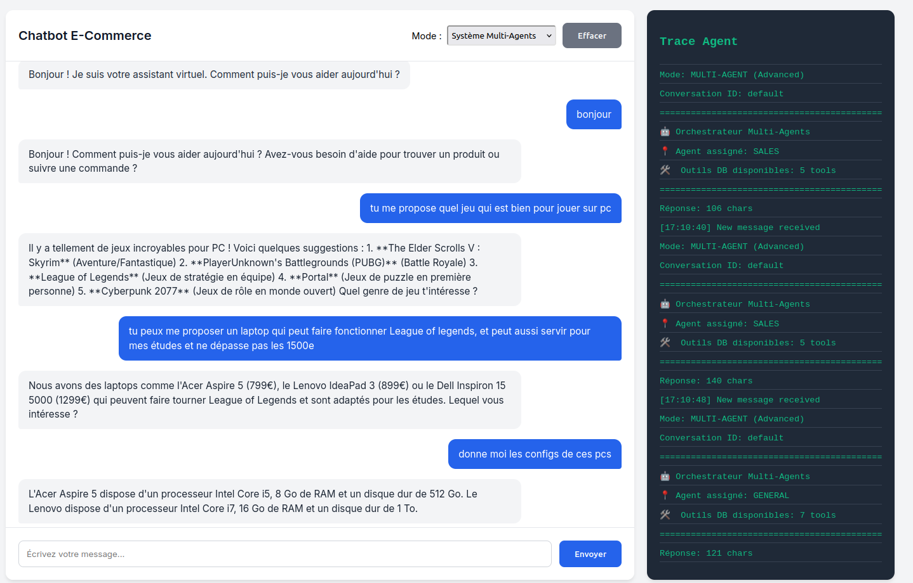
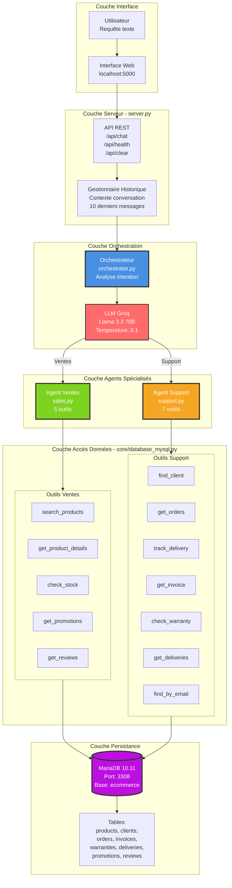
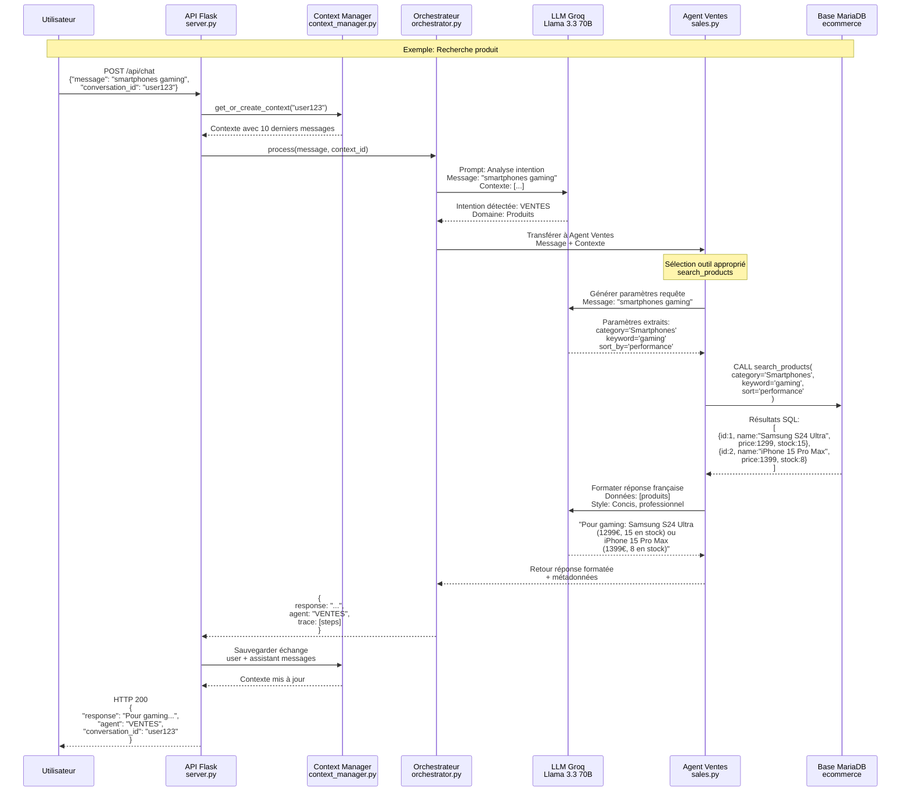

# Système Multi-Agents pour E-Commerce

Chatbot utilisant des agents spécialisés, dans un contexte d'un site e-commerce de vente d'appareils électroniques, avec intégration base de données temps réel.

JOUDI Haroun, FILALI Amine, OUAD Mouad

---

## Résumé du Système

Ce projet implémente un système multi-agents pour le service client e-commerce. Trois agents spécialisés collaborent pour traiter les requêtes utilisateur:

- **Agent Ventes** (5 outils DB): Recherche produits, stock, prix, promotions, avis
- **Agent Support** (7 outils DB): Gestion commandes, livraisons, factures, garanties, SAV
- **Orchestrateur**: Analyse l'intention et route vers l'agent approprié

Le système utilise **LangChain** avec le modèle **Llama 3.3 70B** (via Groq), une base **MariaDB**, et expose une API REST via **Flask**.

---



Pour plus d'exemples, regarder le dossier [screenshots/](screenshots) 

## Installation Rapide

### Méthode 1: Installation Standard

Requires make

```bash

# Installation complète
make install                # Installer dépendances Python
make setup                  # Démarrer base de données + vérifier schéma

# Configuration
echo "GROQ_API_KEY=votre_cle_ici" > .env

# Démarrage
make serve                  # Lancer le serveur

# Accès
# Interface: http://localhost:5000
# phpMyAdmin: http://localhost:3009
```

---

## Installation Manuelle

Si Make n'est pas disponible:

```bash
# 1. Installer dépendances Python
pip install -r requirements.txt

# 2. Démarrer conteneurs Docker
docker Scompose up -d

# 3. Attendre initialisation MySQL (10 secondes)

# 4. Initialiser base de données
docker exec -i chatbot_mariadb mariadb -uroot ecommerce < ecommerce.sql

# 5. Configurer clé API
echo "GROQ_API_KEY=votre_cle_ici" > .env

# 6. Démarrer serveur
python server.py
```

---

```bash
make fresh
```

**Attention:** Cette commande supprime TOUTES les données de la base existante. Utilisez-la uniquement pour:
- Premier démarrage du projet
- Réinitialisation complète après erreurs
- Nettoyage pour tests


---

## Architecture Système

### Vue d'Ensemble

Le système suit une architecture à couches avec séparation claire des responsabilités.



### Flux de Traitement Complet

Séquence détaillée du traitement d'une requête utilisateur depuis la réception jusqu'à la réponse.



### Agents et Outils

| Composant | Agent Ventes | Agent Support |
|-----------|--------------|---------------|
| **Fichier source** | `agents/sales.py` | `agents/support.py` |
| **Modèle LLM** | Llama 3.3 70B (temp: 0.3) | Llama 3.3 70B (temp: 0.2) |
| **Nombre outils** | 5 fonctions database | 7 fonctions database |
| **Domaine métier** | Catalogue, stock, prix, promotions | Commandes, SAV, livraisons, factures |
| **Cas d'usage** | "cherche laptop", "en stock?", "promos" | "commande CMD-123", "où est colis?", "facture" |

---

## Structure du Projet

```
Multi-Agent-Chatbot/
│
├── agents/                         # Agents IA
│   ├── orchestrator.py             #   Routage intelligent basé intention
│   ├── sales.py                    #   Agent ventes (5 outils DB)
│   └── support.py                  #   Agent support (7 outils DB)
│
├── core/                           # Logique métier
│   ├── database_mysql.py           #   17 fonctions accès base données
│   ├── smart_extractor.py          #   Extraction entités (dates, IDs, emails)
│   ├── auth_system.py              #   Authentification clients
│   └── context_manager.py          #   Gestion mémoire conversationnelle
│
├── forms/                          # Gestion formulaires
│   ├── form_manager.py             #   Templates et validation
│   └── secure_forms.py             #   Sécurisation inputs sensibles
│
├── config/                         # Configuration et documentation
│   ├── database_functions.md       #   Catalogue 17 fonctions DB
│   ├── forms_catalog.md            #   Templates formulaires disponibles
│   ├── fallback_strategies.md      #   Stratégies gestion erreurs
│   └── agent_scenarios.md          #   Scénarios test agents
│
├── tests/                          # Tests automatisés
│   ├── test_all_scenarios.py       #   Suite tests (15 scénarios)
│   └── scenarios.json              #   Définitions cas de test
│
│
├── static/                         # Assets frontend
│   ├── css/                        #   Feuilles style
│   └── js/
│       └── script.js               #   Logique interface chat
│
├── templates/                      # Templates HTML
│   └── index.html                  #   Interface principale
│
├── server.py                       # Serveur Flask principal
├── docker-compose.yml              # Configuration Docker services
├── requirements.txt                # Dépendances Python
├── Makefile                        # Commandes automatisation
├── .env                            # Variables environnement (API keys)
└── README.md                       # Cette documentation
```

### Fonctions Base de Données

Le fichier `core/database_mysql.py` contient 17 fonctions organisées par domaine:

**Outils Agent Ventes (5):**

| Fonction | Paramètres | Retour | Description |
|----------|------------|--------|-------------|
| `search_products` | category, keyword, min_price, max_price, sort | liste dicts | Recherche multi-critères avec filtres et tri |
| `get_product_details` | product_id | dict | Informations complètes produit |
| `check_stock` | product_id | dict | Quantité disponible temps réel |
| `get_active_promotions` | - | liste dicts | Promotions en cours avec réductions |
| `get_product_reviews` | product_id | liste dicts | Avis clients et notes moyennes |

**Outils Agent Support (7):**

| Fonction | Paramètres | Retour | Description |
|----------|------------|--------|-------------|
| `find_client_by_reference` | client_ref | dict | Recherche client par référence unique |
| `find_client_by_email` | email | dict | Recherche client par adresse email |
| `get_client_orders` | client_id, limit | liste dicts | Historique commandes client |
| `get_order_details` | order_id | dict | Détails complets commande spécifique |
| `track_delivery` | tracking_number | dict | Statut livraison temps réel |
| `get_invoice` | invoice_id | dict | Détails facture (montants, statut paiement) |
| `check_warranty` | product_id, client_id | dict | Vérification garantie produit |

**Fonctions Générales (5):**

| Fonction | Paramètres | Retour | Description |
|----------|------------|--------|-------------|
| `get_db_connection` | - | Connection | Connexion MySQL/MariaDB |
| `test_connection` | - | bool | Test santé connexion base |
| `get_best_sellers` | limit | liste dicts | Produits plus vendus |
| `get_products_on_promotion` | - | liste dicts | Produits actuellement en promotion |
| `get_client_deliveries` | client_id, limit | liste dicts | Livraisons client |

---

## Tests

### Exécution Tests

```bash
# Via Make
make test

# Manuel
python tests/test_all_scenarios.py
```

### Résultats Actuels

**Statut:** 15 tests sur 15 réussis (100%)

| Catégorie | Nombre Tests | Statut |
|-----------|--------------|--------|
| Requêtes produits (ventes) | 6 | Réussi |
| Requêtes support client | 7 | Réussi |
| Messages généraux/conversation | 2 | Réussi |

### Scénarios Testés

**Tests Ventes:**
- Recherche générique ("smartphones")
- Recherche avec filtres ("laptops gaming moins 1500€")
- Vérification stock produit
- Requête promotions actives
- Recherche multi-critères

**Tests Support:**
- Suivi commande par numéro
- Identification client par référence
- Recherche client par email
- Suivi livraison
- Demande facture
- Vérification garantie

**Tests Généraux:**
- Messages de salutation
- Questions ambiguës
- Gestion erreurs

---

### Métriques Système

| Métrique | Valeur Mesurée | Notes |
|----------|----------------|-------|
| Temps réponse moyen | ~4 secondes | Incluant appel LLM + DB query |
| Taux réussite tests | 100% (15/15) | Tests automatisés |
| Nombre fonctions DB | 17 | 5 ventes + 7 support + 5 générales |
| Précision routage | 100% | Agent correct pour chaque intention |
| Contexte conversation | 10 messages | Mémoire par conversation_id |

### Clés API

- **Groq API Key** (gratuite): https://console.groq.com
  - Créer compte
  - Générer clé API
  - Copier dans `.env`


