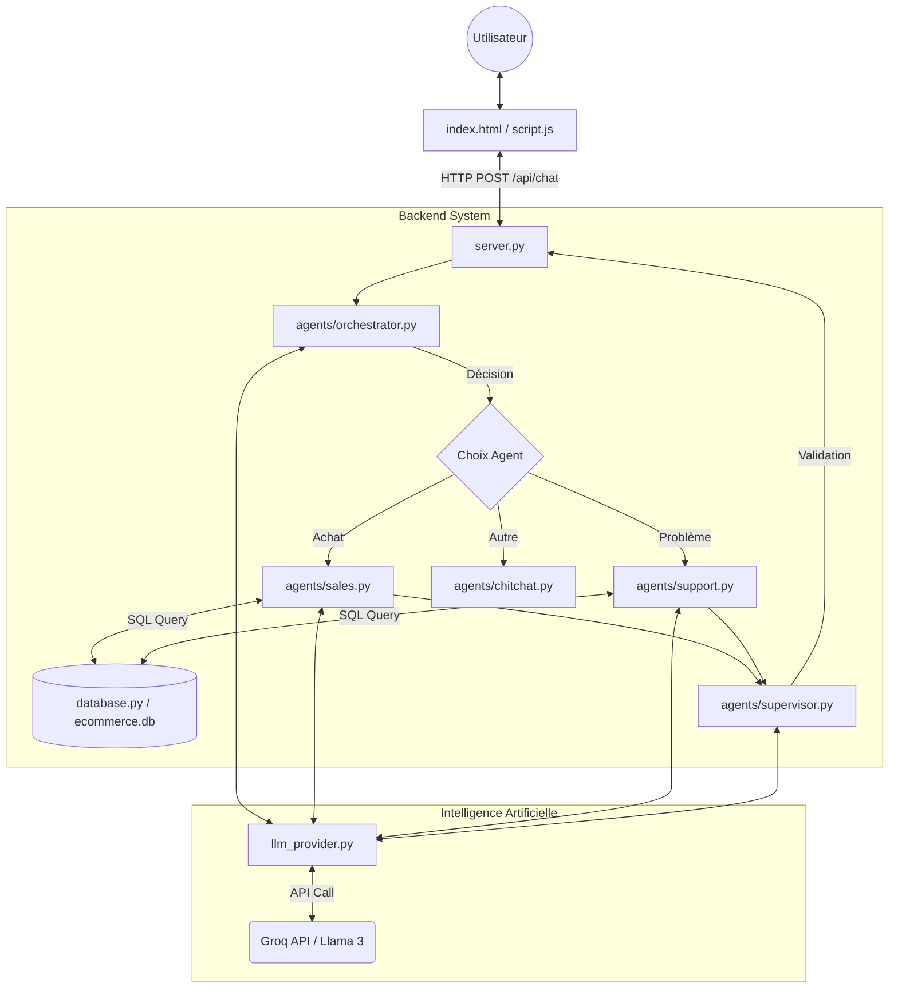

# Multi-Agent E-Commerce Chatbot 🛒

Ce projet implémente un système multi-agents capable de gérer une boutique en ligne via une interface de chat. Voici comment les fichiers sont liés et comment le code s'exécute.

---

## 🏗️ 1. Architecture & Relations entre fichiers

Voici une vue d'ensemble de comment les fichiers interagissent entre eux :



---

## 🔄 2. Flux d'Exécution (Ce qu'il se passe quand vous envoyez un message)

Prenons l'exemple : **"Je veux acheter un iPhone"**.

### Étape 1 : Le Frontend (`index.html` + `script.js`)
*   Vous tapez le message et cliquez sur "Send".
*   `script.js` capture le texte et l'envoie via une requête HTTP (`fetch`) au serveur (`http://localhost:5000/api/chat`).

### Étape 2 : Le Serveur (`server.py`)
*   Le serveur reçoit la requête dans la fonction `chat()`.
*   Il initialise l'**Orchestrator Agent**.

### Étape 3 : L'Orchestration (`agents/orchestrator.py`)
*   Le serveur demande à l'Orchestrateur : *"Quelle est l'intention de ce message ?"*.
*   L'Orchestrateur utilise `llm_provider.py` pour demander à l'IA.
*   L'IA répond : **"SALES"** (Vente).

### Étape 4 : L'Exécution Spécialisée (`agents/sales.py`)
*   Le serveur voit "SALES", donc il active le **Sales Agent**.
*   Le Sales Agent commence par **lire la base de données** (`tools/db_search.py`) pour voir les stocks d'iPhones.
*   Il construit un "Prompt" (consigne) pour l'IA : *"Tu es vendeur. Voici les stocks : iPhone (10 restants). Le client veut un iPhone. Réponds-lui."*
*   L'IA (`llm_provider.py`) génère la réponse : *"Nous avons des iPhones en stock à 999€ !"*.

### Étape 5 : La Supervision (`agents/supervisor.py`)
*   Avant de vous répondre, le serveur envoie cette réponse au **Supervisor Agent**.
*   Le Superviseur vérifie si c'est poli et correct.
*   Il renvoie **"APPROVED"** (ou une version corrigée).

### Étape 6 : Retour au Client
*   `server.py` renvoie la réponse finale au format JSON.
*   `script.js` reçoit la réponse et l'affiche dans la bulle de chat.

---

## 📂 3. À quoi sert chaque fichier ?

| Fichier | Rôle |
|:---|:---|
| **`start.py`** | **Lanceur**. Nettoie le port 5000 et démarre le serveur proprement. |
| **`server.py`** | **Contrôleur**. C'est le chef de gare. Il reçoit les messages et coordonne les agents. |
| **`llm_provider.py`** | **Cerveau**. C'est le seul fichier qui parle à Groq (Llama 3). Tous les agents l'utilisent. |
| **`database.py`** | **Mémoire**. Gère la connexion au fichier de données `ecommerce.db`. |
| **`agents/*.py`** | **Spécialistes**. Contient la logique ("Prompt") de chaque agent (Vendeur, Support, Chef...). |
| **`index.html`** | **Visage**. L'interface graphique que vous voyez. |
| **`script.js`** | **Messager**. Fait le lien entre votre clic de souris et le serveur Python. |

---

## 🚀 Comment lancer le projet ?
Toujours utiliser cette commande :
```bash
python start.py
```
Cela évite les erreurs de port bloqué.
